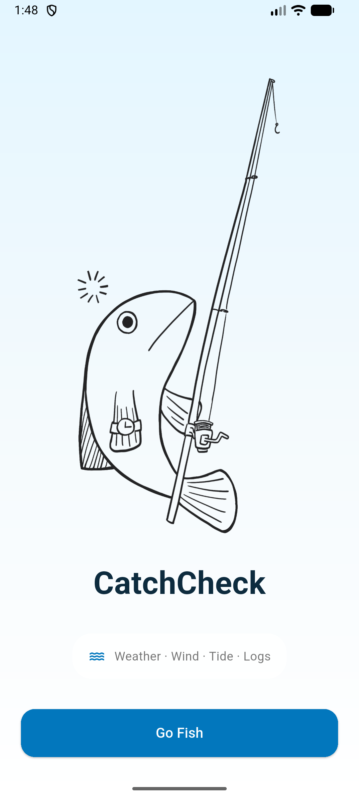
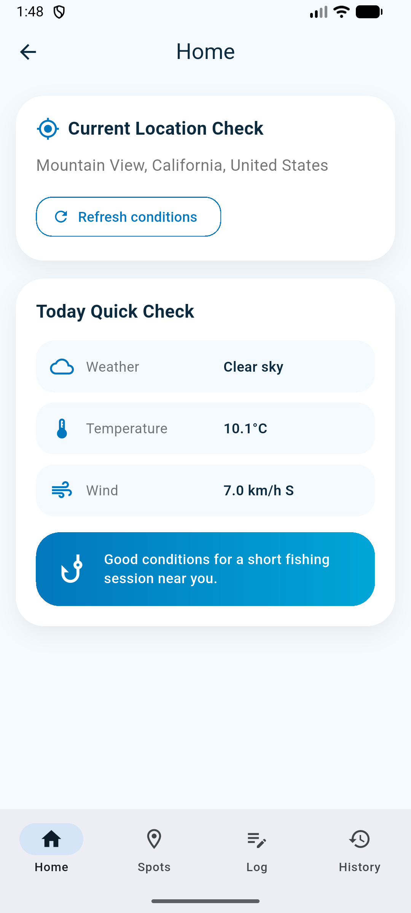
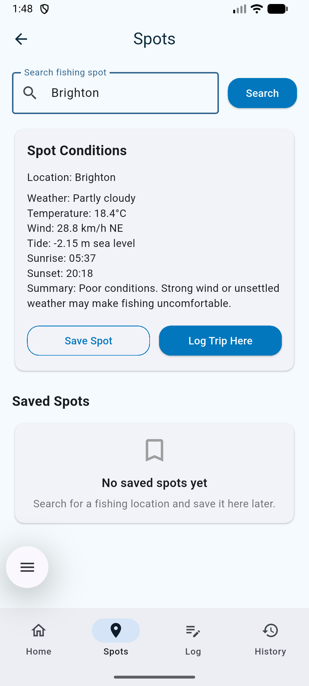
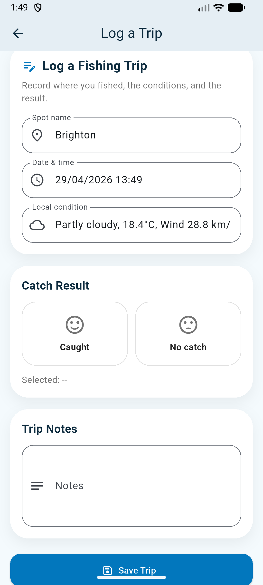
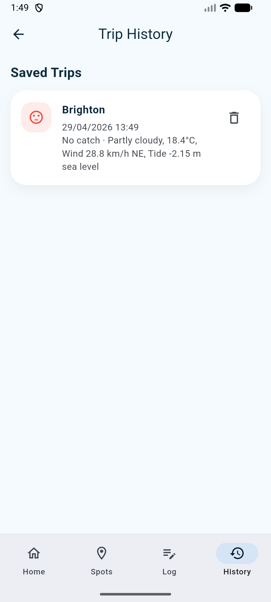

# 🎣 CatchCheck


Fishing decisions are often made based on local environmental conditions such as weather, wind, daylight, and tide. However, this information is usually spread across different apps or websites, and fishing outcomes are often recorded informally and randomly.

CatchCheck is a Flutter mobile application that will combine condition checking and trip logging in one.

---
# Installation
```bash
# clone the repo
$ git clone https://github.com/Kion-82/casa0015-mobile-assessment
$ cd casa0015-mobile-assessment

# install dependencies
$ flutter pub get

# configure Firebase for this local project
$ flutterfire configure

# run in emulator or connected Android device
$ flutter run
```
Prerequisites: Flutter SDK, Dart, Android Studio, an Android emulator or connected Android device, Firebase CLI, FlutterFire CLI, and a Firebase project with Cloud Firestore enabled.

---
## Core Features 📱

### Welcome Screen 🐟



### Home: Current Location Check 📍



It uses the device GPS to read the user's current location, then retrieves live condition data for that location.
Displayed information includes:

- current location name or coordinates,
- weather condition,
- temperature,
- wind speed and direction,
- a simple fishing condition summary.

### Spots: Search and Check Conditions 🔎



It allows the user to search for a fishing location by name, displays current conditions and allows users to compare potential fishing spots before deciding where to go.

Users can also save, delete and reload fishing spots.

### Log a Trip 📝



Users can log and save fishing trips with:

- spot name,
- date and time,
- local condition summary,
- catch result,
- notes.

### Trip History 📚



Trip records are stored in Firebase Cloud Firestore and displayed in the Trip History screen.

Users can view, open and delete saved trip records.

---

## Technical Implementation 🛠️

### Main Packages Used

- `firebase_core`
- `cloud_firestore`
- `geolocator`
- `geocoding`
- `http`

### APIs and Services

| Service | Purpose |
|---|---|
| Device GPS / Geolocator | Reads the user's current location |
| Geocoding | Converts location coordinates into readable place information |
| Open-Meteo Geocoding API | Converts searched place names into coordinates |
| Open-Meteo Weather Forecast API | Retrieves weather, temperature, wind, sunrise, and sunset data |
| Open-Meteo Marine API | Retrieves sea-level height estimate used as a tide-related reference |
| Firebase Cloud Firestore | Stores trip logs and saved spots persistently |
